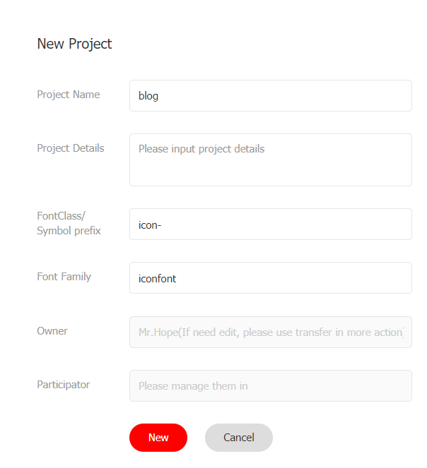

# icon

<NpmBadge package="@vuepress/plugin-icon" />

Provides icon component.

## Usage

```bash
npm i -D @vuepress/plugin-icon@next
```

```ts
import { iconPlugin } from '@vuepress/plugin-icon'

export default {
  plugins: [
    iconPlugin({
      // options
    }),
  ],
}
```

We support multiple types of icons:

- `iconify` (default)
- `fontawesome`
- `iconfont`

Also, you can use images links with any icon types (relative links are NOT supported).

If you want a new type of icon, please open an issue or submit a PR.

In markdown, you can use `::icon decorators... =size /color key=value complex-key="complex value"...::` to insert custom icons.

- A string starting with `=` will be treated as a size definition.
- A string starting with `/` will be treated as a color definition.
- Any string which itself is a valid html attribute will parsed, standardized and added to the icon element.
- The rest part will be treated as the icon name.

```md
::icon =16 /red:: <!-- <VPIcon class="icon" color="red" size="16px" -->

::icon rotate vertical-align=middle:: <!-- <VPIcon icon="icon rotate" vertical-align="middle" -->
```

::: info Demo

::mdi:home /blue::
::mdi:apple =2rem vertical-align=text-bottom::

```md
::mdi:home /blue::
::mdi:apple =2rem vertical-align=text-bottom::
```

:::

## Icon Types

### Iconify

For full icon list, see <https://icon-sets.iconify.design/>. To use a icon, copy it's icon name of `iconify-icon` in the selector.

Additionally, iconify support the following props:

- `mode`: `svg` (default) `style` `bg` or `mask` to change the render icon mode
- `inline`: `false` to disable inline icon
- `flip`: `horizontal` or `vertical` to flip the icon
- `rotate`: `90`, `180`, `270` to rotate the icon

If you use 1 icon set mostly, you can set the prefix to the icon set name (E.g.: `mdi:`), Then you can use the icon name without the prefix. Manually declaring a full icon name will override the prefix:

```md
::home:: <!-- mdi:home -->
::svg-spinners:180-ring:: <!-- svg-spinners:180-ring -->
```

### Font Awesome

For free icon list, see <https://fontawesome.com/v6/search?o=r&m=free>. To use a icon, copy it's icon name in the selector.

The `fontawesome` keyword only includes the free solid and regular icons. If you want to use the brand icons, you need to use the `fontawesome-with-brands` keyword.

Solid icons can be used directly. if you want to use regular or brand icons, you need to add the `regular:` or `brands:` prefix to the icon name:

```md
::home:: <!-- fas fa-home (solid is default) -->
::solid:home:: <!-- fas fa-home -->
::regular:heart:: <!-- far fa-heart -->
::brands:apple:: <!-- fab fa-apple -->
```

Besides, a three letter prefix, first letter or full class name are also supported:

```md
::s:home:: <!-- fas fa-home -->
::fas:home:: <!-- fas fa-home -->
::fa-solid:home:: <!-- fa-solid fa-home -->

::b:apple:: <!-- fab fa-apple -->
::fab:apple:: <!-- fab fa-apple -->
::fa-brands:apple:: <!-- fa-brands fa-apple -->

::r:heart:: <!-- far fa-heart -->
::far:heart:: <!-- far fa-heart -->
::fa-regular:heart:: <!-- fa-regular fa-heart -->
```

You can add other classes that fontawesome supports after the icon name and split them with a space, where `fa-` prefix is optional:

```md
<!-- a small size icon -->

::home fa-sm:: <!-- fas fa-home fa-sm -->

<!-- rotate 180deg -->

::home rotate-180:: <!-- fas fa-home fa-rotate-180 -->
```

See <https://docs.fontawesome.com/web/style/styling> for all available classes.

::: tip Fontaweome Kits and Pro features

By default, we use jsdelivr CDN to load V6 version of fontawesome free icons. This should be enough for most open source projects.

Besides, you can purchase at [fontawesome.com](https://fontawesome.com) to use kits.

Fontawesome kits with pro features support pro icons, more icon styles and uploading your own icons.

For details, please follow [fontawesome document](https://docs.fontawesome.com/).

- [Full Icon List](https://fontawesome.com/search)

:::

### Iconfont

[Iconfont](https://iconfont.cn) is a vector icon management and communication platform created by Alimama MUX.

Every designer can upload icons to Iconfont platform, and users are allow to create projects from these icons. The project can be used in a variety of formats.

### Generating Your Own Iconfont Links

#### Create a project

First, you need to create a new project to set and manage your website's icons:

1. Log in to Iconfont.
1. Find "Resources → My Projects" at the top of the website, and click the "New Project" icon in the upper right corner.
1. Set a recognizable project name
1. Fill in `FontClass/Symbol prefix` with `icon-`. You can also fill in according to your preference, but you need to manually set this value to `prefix` option with an extra `"iconfont"` class in the front, e.g.: `iconfont icon-`



#### Import Icon

Search and find the icon you want to use, and click the "Add to Library" button on the icon


When you complete searching, click the "Add to Library" icon in the upper right corner, click "Add to Project" below, select the project you created then confirm.

#### Edit Icon

On the project page, you can edit the icons in the project, including adjustments with position, size, rotate, color, Unicode number and Font Class / Symbol.


#### Generate Links

Click the "Font Class" button above the project and click Generate.


Then set `assets` option with the generated link.

::: tip

You need to regenerate and update the link every time you add a new icon.

:::

### Images

Images links are supported with any icon types (relative links are NOT supported).

```md
<!-- A full link -->

::https://example.com/icon.png::

<!-- icon.png should be placed in .vuepress/public folder -->

<VPIcon icon="/icon.png" /> <!-- ::/icon.png:: is NOT supported as it will be parsed as color -->
```

## Options

### assets

- Type: `IconAsset`

  ```ts
  export type BuiltInIcon =
    | 'fontawesome-with-brands'
    | 'fontawesome'
    | 'iconify'

  export type IconLink =
    | `//${string}`
    | `/${string}`
    | `http://${string}`
    | `https://${string}`

  export type IconAsset = (BuiltInIcon | IconLink)[] | BuiltInIcon | IconLink
  ```

- Details:

  Icon assets to be used.

  The following keywords are supported and you may use other CDN links or even your own.:

  - `iconify`: Iconify
  - `fontawesome`: Font Awesome free icons only
  - `fontawesome-with-brands`: Font Awesome free icons and brand icons

### type

- Type: `IconType`

  ```ts
  export type IconType = 'fontawesome' | 'iconfont' | 'iconify' | 'unknown'
  ```

- Default: Inferred from the `assets`

- Details:

  Type of the icon, the plugin will try to infer the type from the assets, and fallbacks to `unknown`.

  Notably, the plugin can recognize:

  - iconfont css links
  - fontawesome kits
  - CDN links for fontawesome and iconify

### prefix

- Type: `string`
- Default: Infer from the `assets` and `type`
- Details:

  Prefix for the icon component. By default, the plugin will use:

  - `iconfont icon-` for iconfont type
  - `fas fa-` for fontawesome type
  - empty string for all other types

### component

- Type: `string | null`
- Default: `VPIcon`
- Details:

  Name of the icon component. If set to `null`, the plugin will not register the icon component globally.

### markdown

- Type: `boolean`
- Default: `true`
- Details:

  Whether to enable icon syntax (`::icon::`) in markdown.

## Component Props

### icon {#icon-prop}

- Type: `string`
- Required: Yes
- Details: Icon name

### color

- Type: `string`
- Default: `'inherit'`
- Details: Color used for icon.

### size

- Type: `number | string`
- Default: `Current font size`
- Details: Icon size.

### verticalAlign

- Type: `string`
- Default: `-0.125em`
- Details: Vertical alignment of the icon.

### sizing

- Type: `'width' | 'height' | 'both'`
- Default: `'height'`
- Details: Icon size adjustment method.

  - `width`: Set width only
  - `height`: Set height only
  - `both`: Set width and height
