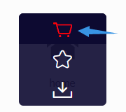

# icon

<NpmBadge package="@vuepress/plugin-icon" />

提供图标组件。

## 使用

```bash
npm i -D @vuepress/plugin-icon@next
```

```ts
import { iconPlugin } from '@vuepress/plugin-icon'

export default {
  plugins: [
    iconPlugin({
      // 选项
    }),
  ],
}
```

我们支持多种类型的图标：

- `iconify`（默认）
- `fontawesome`
- `iconfont`

此外，你也可以使用任何图像链接作为图标（不支持相对链接）。

如果你想要一个新的图标类型，请提交一个议题或提交 PR。

在 Markdown 中，你可以使用 `::icon decorators... =size /color key=value complex-key="complex value"...::` 插入自定义图标。

- 以 `=` 开头的字符串将被视为尺寸定义。
- 以 `/` 开头的字符串将被视为颜色定义。
- 任何本身是有效 html 属性的字符串将被解析、标准化并添加到图标元素中。
- 其余部分将被视为图标名称。

```md
::icon =16 /red:: <!-- <VPIcon class="icon" color="red" size="16px" -->

::icon rotate vertical-align=middle:: <!-- ::icon rotate" vertical-align="middle" -->
```

::: info 案例

::mdi:home /blue::
::mdi:apple =2rem vertical-align=text-bottom::

```md
::mdi:home /blue::
::mdi:apple =2rem vertical-align=text-bottom::
```

:::

## 图标类型

### Iconify

有关完整的图标列表，请参见 <https://icon-sets.iconify.design/>。要使用图标，请复制选择器中的 `iconify-icon` 的图标名称。

此外，iconify 支持以下属性：

- `mode`：`svg`（默认）`style` `bg` 或 `mask` 以更改渲染图标模式
- `inline`：`false` 以禁用内联图标
- `flip`：`horizontal` 或 `vertical` 以翻转图标
- `rotate`：`90`、`180`、`270` 以旋转图标

如果你主要使用 1 个图标集，可以将前缀设置为图标集名称（例如：`mdi:`），然后你可以使用图标名称而无需前缀。手动声明完整图标名称将覆盖前缀：

```md
::home:: <!-- mdi:home -->
::svg-spinners:180-ring:: <!-- svg-spinners:180-ring -->
```

### Font Awesome

有关免费图标列表，请参见 <https://fontawesome.com/v6/search?o=r&m=free>。要使用图标，请复制选择器中的图标名称。

`fontawesome` 关键字仅包括免费的实心和常规图标。如果要使用品牌图标，则需要使用 `fontawesome-with-brands` 关键字。

实心图标可以直接使用。如果要使用常规或品牌图标，则需要在图标名称前添加 `regular:` 或 `brands:` 前缀：

```md
::home:: <!-- fas fa-home (实心是默认的) -->
::solid:home:: <!-- fas fa-home -->
::regular:heart:: <!-- far fa-heart -->
::brands:apple:: <!-- fab fa-apple -->
```

此外，还支持三个字母前缀、第一个字母或完整类名：

```md
::s:home:: <!-- fas fa-home -->
::fas:home:: <!-- fas fa-home -->
::fa-solid:home:: <!-- fa-solid fa-home -->

::b:apple:: <!-- fab fa-apple -->
::fab:apple:: <!-- fab fa-apple -->
::fa-brands:apple:: <!-- fa-brands fa-apple -->

::r:heart:: <!-- far fa-heart -->
::far:heart:: <!-- far fa-heart -->
::fa-regular:heart:: <!-- fa-regular fa-heart -->
```

你可以在图标名称后添加其他 fontawesome 支持的类，并用空格分隔，其中 `fa-` 前缀是可选的：

```md
<!-- 一个小尺寸 icon -->

::home fa-sm:: <!-- fas fa-home fa-sm -->

<!-- 旋转 180° -->

::home rotate-180:: <!-- fas fa-home fa-rotate-180 -->
```

有关所有可用类的详细信息，请参见 <https://docs.fontawesome.com/web/style/styling>。

::: tip Fontaweome 套件和 Pro 功能

默认情况下，我们使用 jsdelivr CDN 来加载 fontawesome 免费图标的 V6 版本。这对于大多数开源项目来说应该足够了。

此外，你可以在 [fontawesome.com](https://fontawesome.com) 购买套件来使用。

具有专业功能的 fontawesome 套件支持专业图标、更多图标样式和上传自己的图标。

有关详细信息，请参见 [fontawesome 文档](https://docs.fontawesome.com/)。

- [完整图标列表](https://fontawesome.com/search)

:::

### Iconfont

[Iconfont](https://iconfont.cn) 是阿里妈妈 MUX 创建的矢量图标管理和交流平台。

每个设计师都可以将图标上传到 Iconfont 平台，用户可以从这些图标中创建项目。项目可以以各种格式使用。

### 生成自己的 Iconfont 链接

#### 创建项目

首先，你需要创建一个新项目来设置和管理你网站的图标：

1. 登录 Iconfont。
1. 在网站顶部找到 "资源管理 → 我的项目"，点击右上角的 "新建项目" 图标。
1. 设置一个可识别的项目名称。
1. 使用 `FontClass/Symbol 前缀` 填写 `icon-`。你也可以根据自己的喜好填写，但是你需要在前面加上一个额外的 `"iconfont"` 类手动设置这个值为 `prefix` 选项，例如：`iconfont icon-`。


#### 导入图标

搜索并找到你想要使用的图标，点击图标上的 "添加到图标库" 按钮。



当你完成搜索后，点击右上角的 "添加到图库" 图标，点击下面的 "添加到项目"，选择你创建的项目然后确认。

#### 编辑图标

在项目页面上，你可以编辑项目中的图标，包括调整位置、大小、旋转、颜色、Unicode 编码和字体类/符号。


#### 生成链接

点击项目上方的 "字体类" 按钮，然后点击 "生成链接"。


然后使用生成的链接设置 `assets` 选项。

::: tip

你需要每次添加新图标时重新生成和更新链接。

:::

### 图片

任何图标类型都支持图像链接（不支持相对链接）。

```md
<!-- 完整链接 -->

::https://example.com/icon.png::

<!-- icon.png 应该放在 .vuepress/public 文件夹中 -->

<VPIcon icon="/icon.png" /> <!-- ::/icon.png:: 是不被支持的，因为它会被解析为颜色 -->
```

## 选项

### assets

- 类型：`IconAsset`

  ```ts
  export type BuiltInIcon =
    | 'fontawesome-with-brands'
    | 'fontawesome'
    | 'iconify'

  export type IconLink =
    | `//${string}`
    | `/${string}`
    | `http://${string}`
    | `https://${string}`

  export type IconAsset = (BuiltInIcon | IconLink)[] | BuiltInIcon | IconLink
  ```

- 详情：

  要使用的图标资源。

  支持以下关键字，你可以使用其他 CDN 链接甚至你自己的：

  - `iconify`：Iconify
  - `fontawesome`：仅限 Font Awesome 免费图标
  - `fontawesome-with-brands`：Font Awesome 免费图标和品牌图标

### type

- 类型：`IconType`

  ```ts
  export type IconType = 'fontawesome' | 'iconfont' | 'iconify' | 'unknown'
  ```

- 默认值：从 `assets` 中推断

- 详情：

  图标的类型，插件将尝试从资源中推断类型，并回退到 `unknown`。

  特别地，插件可以识别：

  - iconfont css 链接
  - fontawesome kits
  - fontawesome 和 iconify 的 CDN 链接

### prefix

- 类型：`string`
- 默认值：从 `assets` 和 `type` 推断
- 详情：

  图标组件的前缀。默认情况下，插件将使用：

  - `iconfont icon-` 用于 iconfont 类型
  - 空字符串用于所有其他类型

### component

- 类型：`string | null`
- 默认值：`VPIcon`
- 详情：

  图标组件的名称。如果设置为 `null`，插件将不会全局注册图标组件。

## 组件属性

### icon {#icon-prop}

- 类型：`string`
- 必填： 是
- 详情： 图标名称

### color

- 类型：`string`
- 默认值：`'inherit'`
- 详情： 图标颜色

### size

- 类型：`number | string`
- 默认值：`当前字体大小`
- 详情： 图标尺寸

### verticalAlign

- 类型：`string`
- 默认值：`-0.125em`
- 详情： 图标垂直对齐方式

### sizing

- 类型：`'width' | 'height' | 'both'`
- 默认值：`'height'`
- 详情： 图标尺寸调整方式

  - `width`：仅设置宽度
  - `height`：仅设置高度
  - `both`：设置宽度和高度
