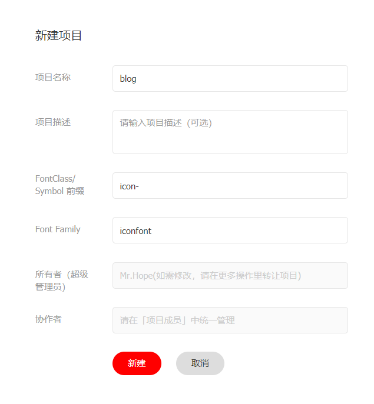
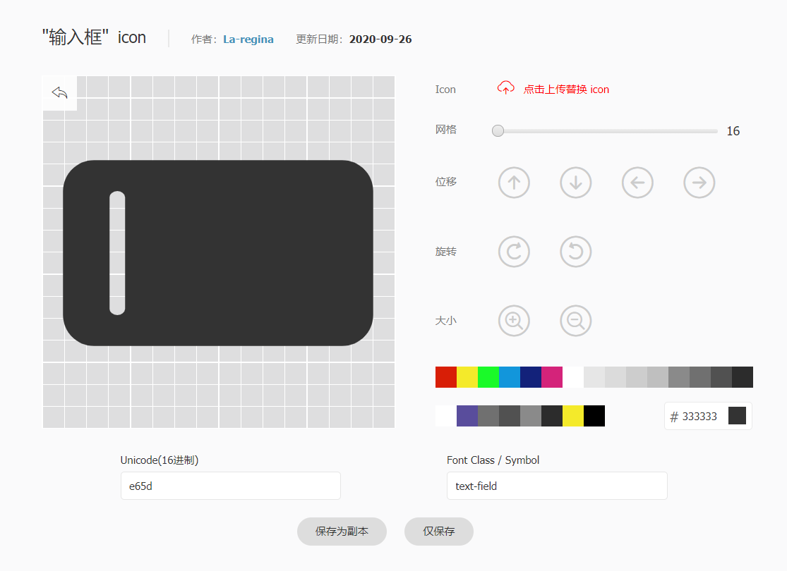
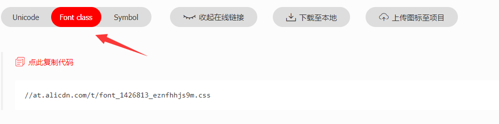

# icon

<NpmBadge package="@vuepress/plugin-icon" />

提供图标组件。

## 使用

```bash
npm i -D @vuepress/plugin-icon@next
```

```ts title=".vuepress/config.ts"
import { iconPlugin } from '@vuepress/plugin-icon'

export default {
  plugins: [
    iconPlugin({
      // 选项
    }),
  ],
}
```

## 指南

### 图标语法

在 Markdown 中，你可以使用 `::icon decorators... =size /color key=value complex-key="complex value"...::` 插入自定义图标。

- 以 `=` 开头的字符串将被视为尺寸定义。
- 以 `/` 开头的字符串将被视为颜色定义。
- 任何本身是有效 html 属性的字符串将被解析、标准化并添加到图标元素中。
- 其余部分将被视为图标名称。

```md
::icon =16 /red:: <!-- <VPIcon icon="icon" color="red" size="16px" /> -->

::icon rotate vertical-align=middle:: <!-- <VPIcon icon="icon rotate" vertical-align="middle" /> -->
```

::: preview

::mdi:home /blue::
::mdi:apple =2rem vertical-align=text-bottom::

:::

## 图标类型

我们支持多种类型的图标：

- `iconify`（默认）
- `fontawesome`
- `iconfont`

此外，你也可以使用任何图像链接作为图标（不支持相对链接）。

如果你想要一个新的图标类型，请提交一个议题或提交 PR。

### Iconify

有关完整的图标列表，请参见 <https://icon-sets.iconify.design/>。要使用图标，请复制选择器中的 `iconify-icon` 的图标名称。

此外，iconify 支持以下属性：

- `mode`：`svg`（默认）`style` `bg` 或 `mask` 以更改渲染图标模式
- `inline`：`false` 以禁用内联图标
- `flip`：`horizontal` 或 `vertical` 以翻转图标
- `rotate`：`90`、`180`、`270` 以旋转图标

如果你主要使用 1 个图标集，可以将前缀设置为图标集名称（例如：`mdi:`），然后你可以使用图标名称而无需前缀。手动声明完整图标名称将覆盖前缀：

```md
::home:: <!-- mdi:home -->
::svg-spinners:180-ring:: <!-- svg-spinners:180-ring -->
```

#### Iconify 离线使用

默认情况下，图标从 Iconify API 加载。要改为本地打包，请设置 `offline` 选项，图标类型默认为 `iconify`。

图标由 `iconify-icon` Web 组件与使用到的每个图标集对应的 `@iconify-json/<prefix>` 包提供，需要将它们安装为开发依赖。例如，如果使用了 `mdi` 集的图标：

```bash
npm i -D iconify-icon @iconify-json/mdi
```

随后页面中用到的图标会被自动打包。图标集会裁剪为使用中的图标，因此产物中只包含使用中的图标：

```ts title=".vuepress/config.ts"
export default {
  plugins: [
    iconPlugin({
      prefix: 'mdi:',
      offline: true,
    }),
  ],
}
```

无法从页面内容中检测到的图标，例如主题配置中使用的图标，需要通过 [scan](#scan) 选项补充。

没有前缀的图标不会被打包，请设置 `prefix` 选项或在图标中写出前缀。

缺少包时会终止构建并给出需要安装的包，被跳过的图标会以警告提示。

::: warning

未被打包的图标在开发服务器中会显示为空白，因为那里拦截了 Iconify API。在构建产物中，当访问者在线时该图标仍会从 Iconify API 加载。

:::

### Font Awesome

有关免费图标列表，请参见 <https://fontawesome.com/search?ic=free>。要使用图标，请复制选择器中的图标名称。

`fontawesome` 关键字仅包括免费的实心和常规图标。如果要使用品牌图标，则需要使用 `fontawesome-with-brands` 关键字。

实心图标可以直接使用。如果要使用常规或品牌图标，则需要在图标名称前添加 `regular:` 或 `brands:` 前缀：

```md
::home:: <!-- fas fa-home (实心是默认的) -->
::solid:home:: <!-- fas fa-home -->
::regular:heart:: <!-- far fa-heart -->
::brands:apple:: <!-- fab fa-apple -->
```

此外，还支持三个字母前缀、第一个字母或完整类名：

```md
::s:home:: <!-- fas fa-home -->
::fas:home:: <!-- fas fa-home -->
::fa-solid:home:: <!-- fa-solid fa-home -->

::b:apple:: <!-- fab fa-apple -->
::fab:apple:: <!-- fab fa-apple -->
::fa-brands:apple:: <!-- fa-brands fa-apple -->

::r:heart:: <!-- far fa-heart -->
::far:heart:: <!-- far fa-heart -->
::fa-regular:heart:: <!-- fa-regular fa-heart -->
```

你可以在图标名称后添加其他 fontawesome 支持的类，并用空格分隔，其中 `fa-` 前缀是可选的：

```md
<!-- 一个小尺寸 icon -->

::home fa-sm:: <!-- fas fa-home fa-sm -->

<!-- 旋转 180° -->

::home rotate-180:: <!-- fas fa-home fa-rotate-180 -->
```

有关所有可用类的详细信息，请参见 <https://docs.fontawesome.com/web/style/styling>。

#### Font Awesome 离线使用

默认情况下，图标从 jsdelivr CDN 加载。要改为本地打包，请设置 `offline` 选项，并让 `assets` 选项包含 Font Awesome 资源，使图标类型为 `fontawesome`。

图标由 `@fortawesome` 包提供，需要将它们安装为开发依赖。`@fortawesome/fontawesome-svg-core` 始终需要，每种图标样式还需要各自的包：

| 样式      | 包                                    |
| --------- | ------------------------------------- |
| `solid`   | `@fortawesome/free-solid-svg-icons`   |
| `regular` | `@fortawesome/free-regular-svg-icons` |
| `brands`  | `@fortawesome/free-brands-svg-icons`  |

只打包页面中用到的图标时，只需安装用到的样式对应的包：

```bash
# 使用了 solid 和 brands 图标，不需要 regular
npm i -D @fortawesome/fontawesome-svg-core @fortawesome/free-solid-svg-icons @fortawesome/free-brands-svg-icons
```

随后页面中用到的图标会被自动打包：

```ts title=".vuepress/config.ts"
export default {
  plugins: [
    iconPlugin({
      assets: 'fontawesome',
      offline: true,
    }),
  ],
}
```

无法从页面内容中检测到的图标，例如主题配置中使用的图标，需要通过 [scan](#scan) 选项补充。

打包全部免费图标时需要三个样式包，因为每个样式都是整体导入的：

```bash
npm i -D @fortawesome/fontawesome-svg-core @fortawesome/free-solid-svg-icons @fortawesome/free-regular-svg-icons @fortawesome/free-brands-svg-icons
```

```ts
iconPlugin({ assets: 'fontawesome', offline: 'all' })
```

图标的检测方式与渲染方式一致，因此图标中包含的类可以任意排序：

```md
::house fa-sm:: <!-- 图标名在前 -->
::fa-sm fa-house:: <!-- 类在前 -->
```

缺少包时会终止构建并给出需要安装的包，被跳过的图标会以警告提示。

::: warning

离线模式只打包免费图标。该模式下不会从 CDN 加载 Font Awesome 资源（包括套件），因此未被打包的图标不会渲染。

:::

::: tip FontAwesome 套件和 Pro 功能

默认情况下，我们使用 jsdelivr CDN 来加载 FontAwesome 免费图标的 V7 版本。这对于大多数开源项目来说应该足够了。

此外，你可以在 [fontawesome.com](https://fontawesome.com) 购买套件来使用。

具有专业功能的 FontAwesome 套件支持专业图标、更多图标样式和上传自己的图标。

有关详细信息，请参见 [FontAwesome 文档](https://docs.fontawesome.com/)。

- [完整图标列表](https://fontawesome.com/search)

:::

### Iconfont

[Iconfont](https://iconfont.cn) 是阿里妈妈 MUX 创建的矢量图标管理和交流平台。

每个设计师都可以将图标上传到 Iconfont 平台，用户可以从这些图标中创建项目。项目可以以各种格式使用。

### 生成自己的 Iconfont 链接

#### 创建项目

首先，你需要创建一个新项目来设置和管理你网站的图标：

1. 登录 Iconfont。
1. 在网站顶部找到 "资源管理 → 我的项目"，点击右上角的 "新建项目" 图标。
1. 设置一个可识别的项目名称。
1. 使用 `FontClass/Symbol 前缀` 填写 `icon-`。你也可以根据自己的喜好填写，但是你需要在前面加上一个额外的 `"iconfont"` 类手动设置这个值为 `prefix` 选项，例如：`iconfont icon-`。



#### 导入图标

搜索并找到你想要使用的图标，点击图标上的 "添加到图标库" 按钮。


当你完成搜索后，点击右上角的 "添加到图库" 图标，点击下面的 "添加到项目"，选择你创建的项目然后确认。

#### 编辑图标

在项目页面上，你可以编辑项目中的图标，包括调整位置、大小、旋转、颜色、Unicode 编码和字体类/符号。



#### 生成链接

点击项目上方的 "字体类" 按钮，然后点击 "生成链接"。



然后使用生成的链接设置 `assets` 选项。

::: tip

你需要每次添加新图标时重新生成和更新链接。

:::

### 图片

任何图标类型都支持图像链接（不支持相对链接）。

```md
<!-- 完整链接 -->

::https://example.com/icon.png::

<!-- icon.png 应该放在 .vuepress/public 文件夹中 -->

<VPIcon icon="/icon.png" /> <!-- ::/icon.png:: 是不被支持的，因为它会被解析为颜色 -->
```

## 选项

:::: fields
@`assets` type=`IconAsset` default=`'iconify'`

要使用的图标资源。

支持以下关键字，你可以使用其他 CDN 链接甚至你自己的：

- `iconify`：Iconify
- `fontawesome`：仅限 Font Awesome 免费图标
- `fontawesome-with-brands`：Font Awesome 免费图标和品牌图标

@`type` type=`IconType`

图标的类型，默认从 `assets` 中推断，并回退到 `unknown`。

特别地，插件可以识别：

- iconfont css 链接
- fontawesome kits
- fontawesome 和 iconify 的 CDN 链接

@`prefix` type=string

图标组件的前缀，默认从 `assets` 和 `type` 推断。插件将使用：

- `iconfont icon-` 用于 iconfont 类型
- 空字符串用于所有其他类型

@`component` type=string default=`'VPIcon'`

图标组件的名称。

@`markdown` type=boolean default=`true`

是否在 Markdown 中启用图标语法（`::icon::`）。

@`offline` type=`boolean | 'all'`

本地打包图标，而非从 CDN 或 Iconify API 加载，使站点无需联网即可访问。

图标按站点的图标类型打包，因此该选项不会影响 `type` 与 `assets` 选项。

仅 `fontawesome` 与 `iconify` 的图标可以打包，图标类型为其他值（如 `iconfont`）时会终止构建。

- `true`：打包站点用到的图标，它们会从页面内容、front matter 与组件属性中检测，见 [scan](#scan) 选项。
- `"all"`：打包该图标类型的全部图标。仅 `fontawesome` 支持，因为一个 Iconify 图标集可能包含数千个图标，`iconify` 下会改为打包站点用到的图标。

```ts title=".vuepress/config.ts"
export default {
  plugins: [
    iconPlugin({
      prefix: 'mdi:',
      offline: true,
    }),
  ],
}
```

图标在站点准备阶段检测，因此新增图标后需要重启开发服务器。

参考：[Iconify 离线使用](#iconify-离线使用)与 [Font Awesome 离线使用](#font-awesome-离线使用)。

::: tip

打包全部 Font Awesome 图标会为客户端产物增加约 1.8 MB，而 Iconify 的产物只包含使用中的图标。

:::

@`scan` type=`IconScan`

需要扫描图标的字段，供 [offline](#offline) 选项使用，未启用离线模式时该选项无效。

`frontmatter` 与 `components` 为字段路径，支持字段访问与数组下标，其中 `[*]` 匹配数组的每个元素。不存在的字段会被静默跳过。

@@`scan.frontmatter` type=`string[]` default=`['icon']`

页面的 front matter 字段，例如 `['icon', 'features[*].name']`。设为 `[]` 可关闭 front matter 扫描。

@@`scan.components` type=`string[]`

页面中使用的组件的属性，形式为 `<组件>.<属性>`，例如 `['VPCustom.icon', 'VPTest.files[*]']`。

组件的属性会作为一个对象读取，因此 `VPCustom.icon` 读取 `icon` 属性，而 `VPTest.files[*]` 读取 `files` 属性的每个元素。用 `:prop` 或 `v-bind` 绑定的属性在值无法解析为 JSON 时会给出警告，因为此时其图标无法被打包。

@@`scan.scanner` type=`(app: App) => string[] | Promise<string[]>`

用于获取无法被检测到的图标的额外扫描器，例如主题配置中使用的图标。

返回的图标使用与 Markdown 中一致的语法，Iconify 为 `mdi:home`，Font Awesome 为 `solid:house`。

```ts title=".vuepress/config.ts"
export default {
  plugins: [
    iconPlugin({
      offline: true,
      scan: {
        frontmatter: ['icon', 'features[*].name'],
        components: ['VPCustom.icon'],
        scanner: (app) => ['mdi:home'],
      },
    }),
  ],
}
```

::: tip

可复用的辅助函数会被导出，因此扫描器可以基于它们构建：

```ts
import {
  extractIconsFromComponents,
  extractIconsFromFields,
  parseComponentField,
} from '@vuepress/plugin-icon'

// 读取某个对象中的图标，例如主题配置或数据文件
extractIconsFromFields(data, ['icon', 'features[*].name'])

// 读取站点组件属性中的图标
extractIconsFromComponents(
  app,
  ['VPCustom.icon'].map(parseComponentField).filter((field) => field != null),
)
```

:::

::::

## 组件属性

### icon {#icon-prop}

- 类型：`string`
- 必填：是
- 详情：图标名称

### color

- 类型：`string`
- 默认值：`"inherit"`
- 详情：图标颜色

### size

- 类型：`number | string`
- 默认值：当前字体大小
- 详情：图标尺寸

### verticalAlign

- 类型：`string`
- 默认值：`"-0.125em"`
- 详情：图标垂直对齐方式

### sizing

- 类型：`"height" | "both"`
- 默认值：`"height"`
- 详情：

  图标的约束方式：

  - `height`：仅约束高度，宽度随图标比例变化。
  - `both`：同时约束宽度和高度，图标等比缩放以填满尺寸框，不会被拉伸。

  FontAwesome 将每个图标绘制在 `1.25em × 1em` 的画布上（默认 `16px` 字号下为 `20px × 16px`）并将图形居中，因此宽图标不会被压扁。这正是 `sizing="both"` 的行为，可让 FontAwesome 图标在列表、侧边栏和工具条中保持对齐。

  其他图标类型使用 `1em × 1em` 的方形画布。
